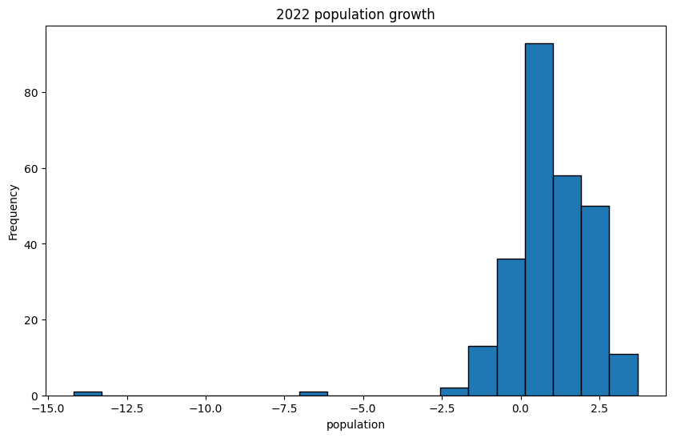

|    | describe   |       2015 |       2016 |       2017 |       2018 |       2019 |       2020 |       2021 |       2022 |
|---:|:-----------|-----------:|-----------:|-----------:|-----------:|-----------:|-----------:|-----------:|-----------:|
|  0 | count      | 266        | 266        | 266        | 266        | 266        | 266        | 266        | 266        |
|  1 | null_count |   1        |   1        |   1        |   1        |   1        |   1        |   1        |   1        |
|  2 | mean       |   1.322    |   1.26865  |   1.19603  |   1.1786   |   1.15641  |   1.0565   |   0.90213  |   0.919054 |
|  3 | std        |   1.4035   |   1.28828  |   1.25121  |   1.26295  |   1.2053   |   1.18345  |   1.27481  |   1.50851  |
|  4 | min        |  -4.41574  |  -2.21728  |  -3.75548  |  -4.04839  |  -2.905    |  -2.98408  |  -4.25665  | -14.1885   |
|  5 | 25%        |   0.497673 |   0.451994 |   0.380617 |   0.362584 |   0.371554 |   0.243223 |   0.180461 |   0.285874 |
|  6 | 50%        |   1.14094  |   1.13323  |   1.14872  |   1.14055  |   1.07497  |   1.01104  |   0.902989 |   0.895297 |
|  7 | 75%        |   2.20032  |   2.16234  |   2.07956  |   2.03273  |   1.97846  |   1.89786  |   1.7961   |   1.81316  |
|  8 | max        |   9.21992  |   7.2128   |   4.39455  |   4.55608  |   3.93136  |   3.7271   |   3.70742  |   3.71299  |

